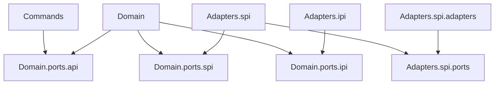

# AEM Control Application Architecture

This application uses an [hexagonal architecture](https://en.wikipedia.org/wiki/Hexagonal_architecture_(software)) that is enforced using an [ArchUnit](https://www.archunit.org/) [test](/aem_cntrl/src/test/java/com/_4point/aem/aem_utils/aem_cntrl/domain/ArchUnitTest.java).

The Commands layer interprets the command line arguments and makes a call to the Domain layer via interfaces in the Domain API layer.

The Domain layer contains the bulk of the application logic. The classes in this layer do not interface with external resources directly 
but instead access them through the Domain IPI (Internal Provider Interfaces) and Domain SPI layers (Service Provider Interfaces). 
The IPI layer is to isolate the Domain layer from external class libraries that may change or be replaced. 
The SPI layer is to isolate the Domain layer from external class libraries that interact with external resources (which also may change or be replaced).

The Adapters layer has the implementation classes for the Domain IPI and SPI layers.  It also has its own internal port/adapters layer to isolate the
adapters logic from the libraries it uses (i.e. an anti-corruption layer to further isolate the adapter logic from complicated third-party library apis).

The Spring configuration classes ([AemCntrlAemConfiguration](/aem_cntrl/src/main/java/com/_4point/aem/aem_utils/aem_cntrl/AemCntrlAemConfiguration.java), 
and [AemCntrlApplication](/aem_cntrl/src/main/java/com/_4point/aem/aem_utils/aem_cntrl/AemCntrlApplication.java)) must access every layer in order 
to wire together all the classes into the structure outlined above.

In a hexagonal architeture the ports layers provide interfaces that allow one layer to interact with another. 
Each non-port layer can be instantiated and tested separately (mocking the ports it uses) which makes each layer easier to test. 
The Domain layer is easiest to test because (by definition) any interactions it has with the layer outside of it happen 
through the port interfaces which can be easily mocked. 
The Adapters layer is a little harder to mock as it requires mocking of the external resources it deals with. 
This often makes the Adapter layer tests more like an integration test although it's usually possible to mock the outside resources using
libraries like Wiremock, temporary file systems, etc.

Adhereing to this predefined architecture makes the whole application more testable and therefore more reliable.